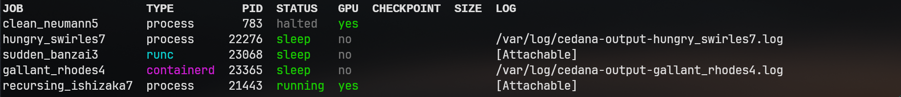

# Managed process/container

The Cedana daemon is designed to manage the entire lifecycle of a process/container, including checkpoint/restore, in the larger Cedana system.

Managed processes/containers are those that are spawned using `cedana run` ([CLI reference](../references/cli/cedana_run.md)). This command creates a managed job, which can be checkpointed and restored using `cedana dump job` and `cedana restore job` subcommands.

<figure><figcaption></figcaption></figure>

By default, jobs are stored in a local DB (in `/tmp`). You may set the `db.path` in [configuration](../get-started/configuration.md) to change the path to persist it across restarts. If you're authenticated, you may set the `db.remote` to `true` in [configuration](../get-started/configuration.md) to use a remote DB at your specified Cedana endpoint instead.

## Create a new job

To run a new managed job:

```sh
cedana run <type> ...
```

Where `<type>` can be `process`, `containerd`, `runc`, etc. See [features](../get-started/features.md) for all plugins that support running managed jobs.

For example, to run a new managed process:

```sh
cedana run process --jid <job_id> -- echo "Hello, world!"
```

The `--jid` flag is optional, and if not provided, a random job ID will be generated.

## Manage an existing job

It's also possible to start managing an existing process/container:

```sh
cedana manage <type> ...
```

Where `<type>` can be `process`, `containerd`, `runc`, etc. See [features](../get-started/features.md) for all plugins that support managing existing jobs.

For example, to manage an existing process:

```sh
cedana manage process <PID> [args...]
```

## Manage an upcoming job

It's also possible to start managing an upcoming process/container:

```sh
cedana manage --upcoming <type> ...
```

Where `<type>` can be `process`, `containerd`, `runc`, etc. See [features](../get-started/features.md) for all plugins that support managing upcoming jobs. The manage command will block and wait for the process/container to become available.

For example, to manage an existing runc container:

```sh
cedana manage --upcoming runc <container-id> [args...]
```

## List managed jobs

The subcommand `cedana job` has many subcommands such as `list`, `kill`,m `delete`, etc. Check the [CLI reference](../references/cli/cedana_job.md) for all available subcommands.

```sh
cedana job list
```

```
JOB             TYPE      PID  STATUS  GPU  CHECKPOINT  SIZE  LOG
used_gould8     process  5336  halted  yes                    /var/log/cedana-output-used_gould8.log
clean_davinci7  runc     3680  halted  no
easy_tu9        process  3892  halted  yes
```

`cedana ps` is a shorthand for `cedana job list`.

## Attach I/O

To attach to the I/O of a job, use the `--attach` flag:

```sh
cedana run <type> --attach ...
```

This will attach the standard input, output, and error streams to the terminal, including the job's exit status. Press `Ctrl+C` to detach, and the job will continue running in the background.

If you list the jobs, you will see that the job is attachable:

```
JOB             TYPE      PID  STATUS  GPU  CHECKPOINT  SIZE  LOG
clean_davinci7  runc     3680  halted  no                     [Attachable]
```

To attach to the job again, use the `cedana job attach` subcommand:

```sh
cedana job attach <job_id>
```

Or the generic `cedana attach` if you want to attach using the job's PID:

```sh
cedana attach <PID>
```

If you want to make a job attachable, but not attach to it immediately, you can use the `--attachable` flag:

```sh
cedana run <type> --attachable ...
```

## View job logs

By default, the jobs stdout/stderr are stored in the `/var/log/` directory. If you do `cedana job list`, you will see the path to the log file.

```
JOB             TYPE      PID  STATUS  GPU  CHECKPOINT  SIZE  LOG
used_gould8     process  5336  halted  yes                    /var/log/cedana-output-used_gould8.log
```

You can also pass a custom log path. See [CLI reference](../references/cli/cedana_run.md) for `cedana run` subcommand.

If the job has attachable I/O, it will appear as such:

```
JOB             TYPE      PID  STATUS  GPU  CHECKPOINT  SIZE  LOG
used_gould8     process  5336  halted  yes                    [Attachable]
```

## Checkpoint/restore

Once the daemon has started managing a job, it can be checkpointed and restored using the `cedana dump job` and `cedana restore job` subcommands. See [managed checkpoint/restore basics](./cr.md#managed-checkpoint-restore) for more information.

## Checkpoint/restore with GPUs

GPU C/R support is also available for managed jobs. Check out the [checkpoint/restore with GPUs](./gpu/cr.md) guide for more information.
